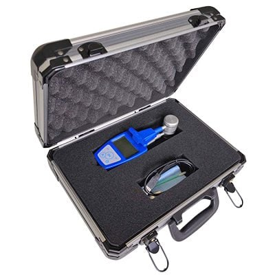
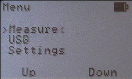
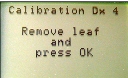
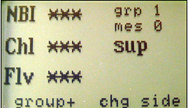
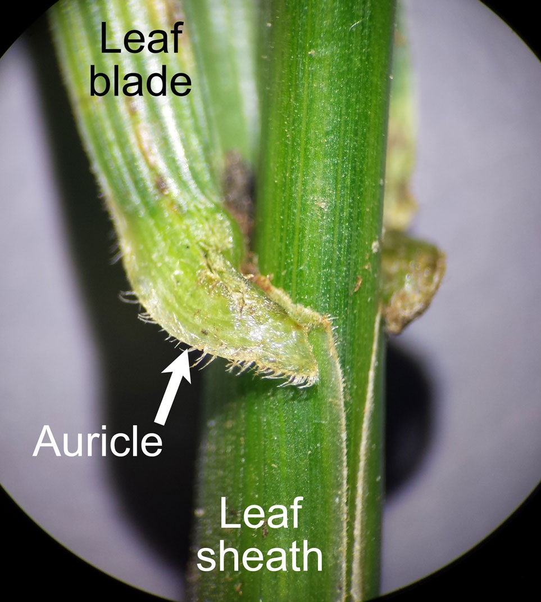
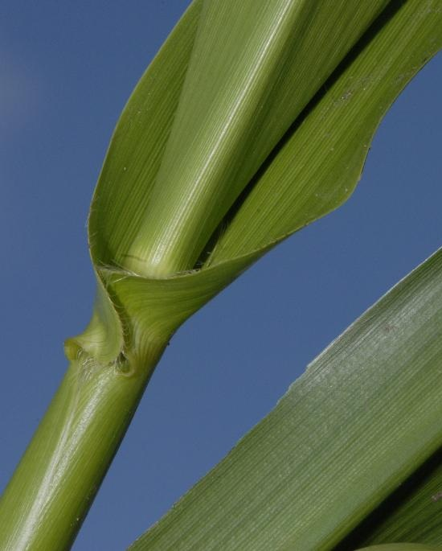

Measures **chlorophyll** (µg/cm²) and **flavonols** (relative index) in leaves, using light transmission and fluorescence.

## Description

The Dualex has a handle that opens the clip. By pressing the handle, the clip opens, allowing the leaf to be inserted between the two heads. When the handle is released, the heads hold the leaf securely in place, enabling the measurement. The clip remains normally closed when not in use.

## Turning On the DUALEX

1.  Press the ON/OFF button on the keyboard.

The Main Menu will be displayed.

2.  Select the Measure sub-menu and press the OK button.

3.  Before taking any measurement, the DUALEX will prompt for calibration. The following screen will appear:

4.  Ensure there is no leaf between the heads of the leaf-clip. Make sure the clip is closed. Press OK.

### Performing a Measurement

1.  Open the clip by pressing the **handle** and insert a leaf.

2.  Release the handle to close the clip.

-   **One beep** indicates the measurement was successful.

-   **Two beeps** indicate an error; replace the leaf and try again.

3.  Record the following for each measurement:

-   **Grp**: Group number (e.g., Grp 1)

-   **Mes**: Measurement number within the group (increments with each measurement)

> ???+ note "Important!"
    Always verify the group and measurement numbers. Sometimes the device changes the group mid-set or records measurements incorrectly.

## Corn

Take measurements on the **first fully expanded leaf** from the top (auricles not folded around the stem).

<figure markdown="span">
	{ Width=350 }
	<figcaption>**Fully open**</figcaption>
</figure>

{ width=350}
/// caption
**Not fully opened**
///

Skip one leaf, then **measure the third leaf.**

Record the group number and measurement number, not the raw values from the device.

## Transferring Data to a Computer

1.  Connect the USB cable to the mini USB port on the bottom of the DUALEX and to a USB port on your computer.

2.  Select the USB sub-menu on the DUALEX and press OK.

3.  The DUALEX will appear as a removable disk (similar to a USB flash drive).

4.  Open the removable disk folder using your computer’s file explorer.

5.  Locate the file named DX--------, which contains all measurement data (-------- indicates the date of the measure)

6.  Copy the file to your computer to analyze data.
