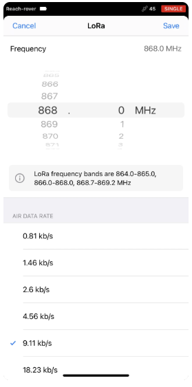

# Guide to Using Emlid GNSS System for Field Work

The Emlids can be used as a base/rover pair or as individual rovers working in parallel to collect cm level data. Below are instructions to configure the Emlids to be used in either configuration.

### **Emlids as Base/Rover Pair**
???+ note "Note On Emlid Base Position Accuracy"
    Using the Emlids in this configuration will give you the greatest precision and lowest latency corrections, but absolute accuracy may be poor if a local base position is not established.

#### Step 1. Setting up Base Station
???+ note "Note On Base Setup"
The base can be setup on a predefined location pin with exact known coordinates, or can be used on the fly for data collection, as long as it is in the same location for long enough (at least 15 minutes, ideally > 2 hours). 

### Setting Up LoRa Communications

