## Background

This guide outlines how single-plant maize samples are processed in
preparation for C:N analysis.

The heights of individual maize plants were measured throughout the
growing season. These plants grew in different treatment zones
(Pixels) and were marked with a colored zip tie to ensure the same
plant was measured each time.

At the end of the growing season these plants were harvested, bagged
individually, and oven dried to constant weight. Each of these plants
will be sent for C:N analysis of both the grain and the biomass. All
samples must be weighed and ground fine to submit to the plant tissue
analysis lab.

## Equipment

- Scale (in the drying shed)

- Scissor/pruner/knife (to cut zip ties holding bags closed)

- 2qt container

- (3+) Bus tubs

- Felt tip pen

- Ballpoint pen

- Tablet computer (for data logging)

  - Clipboard and paper if tablet not available

- Envelopes (#2 or similar size)

- Coffee grinder & spare cups

- Dust masks

- Hammer mill (in drying shed)

- Air compressor (in the drying shed)

- Packing tape

## Room Preparation

- Plug in air compressor

- Move hammer mill to suitable location

  - Outside if the weather is cooperative, near the rollup door if not

- Open hammer mill to make sure there is no leftover biomass from
  previous sessions

- Ensure the screen has ½" holes, replace if not

  - Other screens are typically near the back corner on the counter

- Close hammer mill and secure the wing screws

- Plug in hammer mill

## Sample Preparation

- Grab sample bag (either paper or burlap)

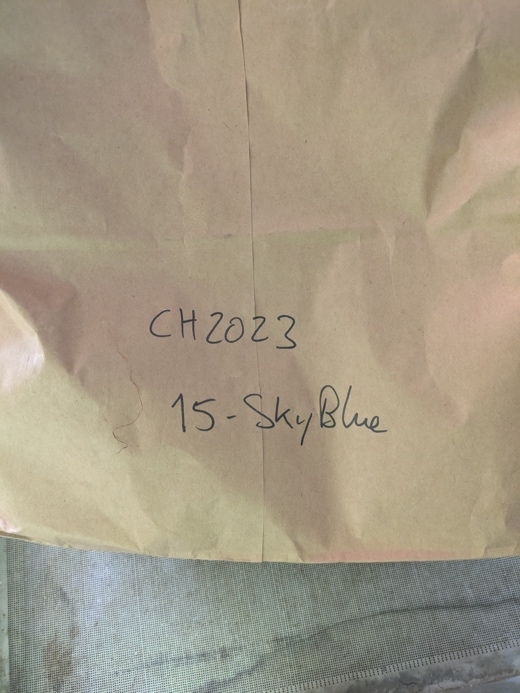

- Dump contents onto oven tray

  - There should be many on the nearby shelves

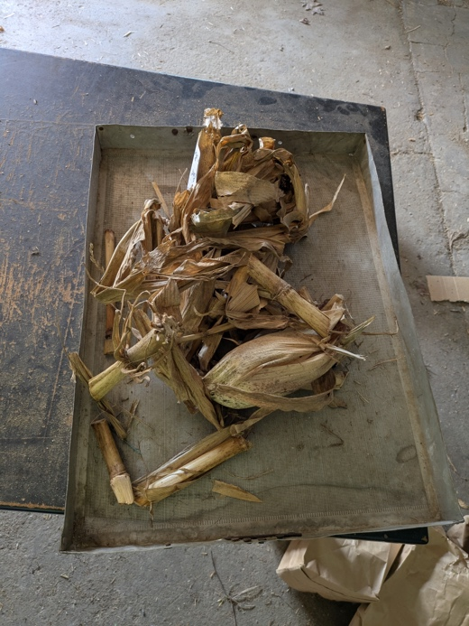

- Remove index card and zip tie

  - Confirm zip tie color matches what's written on the card

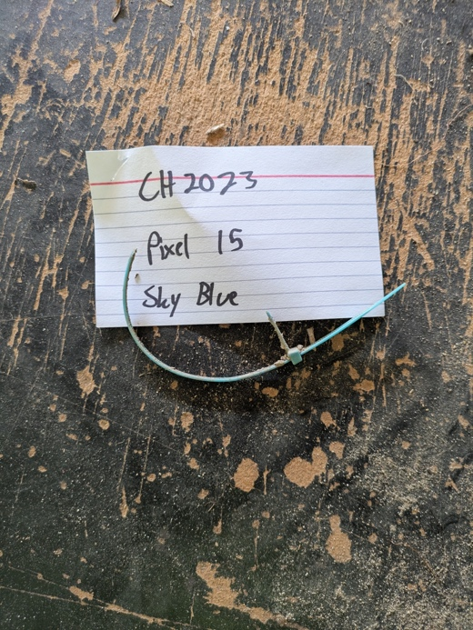

- Label 2 envelopes with information from the index card, 1 for grain, 1
  for biomass

  - 'CH202X'

'Pixel #'

'Zip tie color'

'Grain' or 'Biomass'

- Remove maize ear(s), leaving husk with remaining plant biomass

  - Note if there are more than one

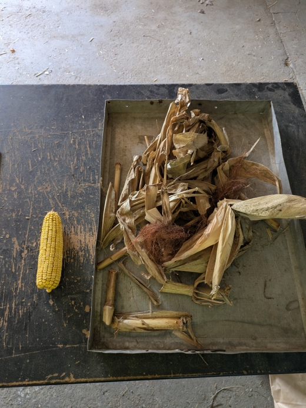

## Grain Processing

- Strip grain from ear(s) into container and discard cob

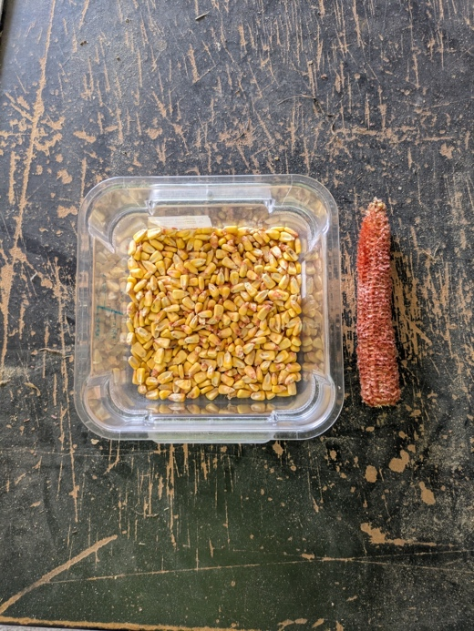

- Place a small empty container on the scale

- Zero out the scale (->O/T<- button)

- Wait for scale to reach 0

  - It helps to have the window by the scale closed

- Pour maize grain into container and record weight

  - 'Total Grain Weight (g)' in the data sheet

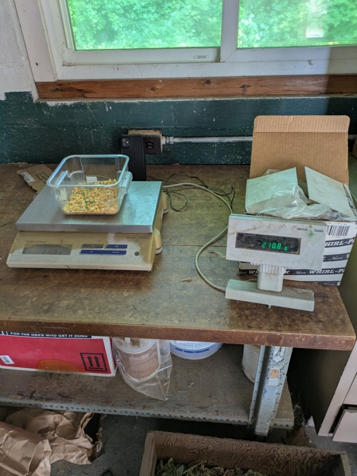

- Place envelope marked "Grain" in the container with the grain

  - This helps prevent samples from getting mixed up, especially with
    multiple people

- Pour some of the grain into the coffee grinder cup (just enough that
  you can't see the blades)

- Grind grain into a fine powder

- Place several grams of the ground grain into the labeled envelope

- Tape the envelope closed and place with other completed samples

- Clean out the grinder cup using the air compressor

## Biomass Processing

- Place empty bus tub on the scale

- Zero the scale again

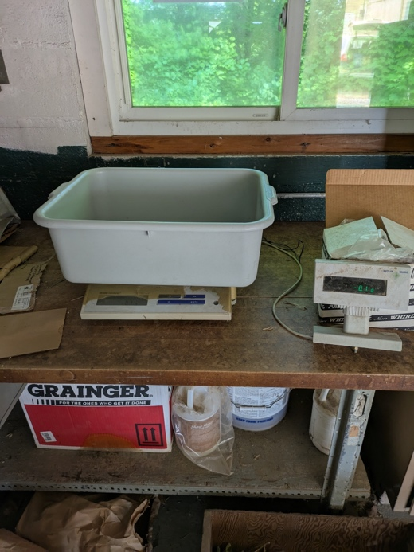

- Place all plant biomass in tub and record weight

  - 'Biomass (g)' in the data sheet

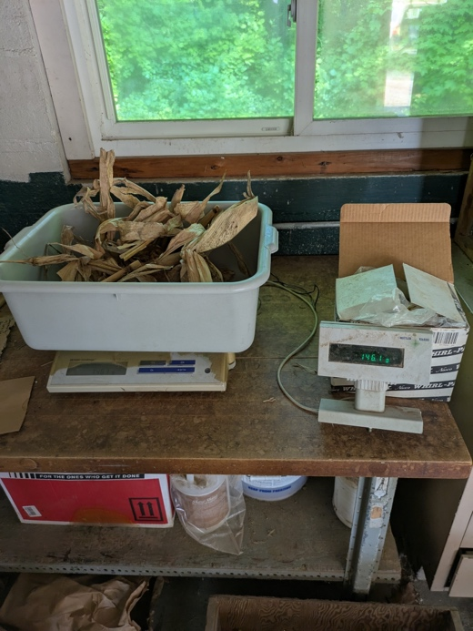

- Place envelope marked "Biomass" in the tub

- Bring tub to hammer mill

- Place an empty bus tub under the hammer mill to catch shredded biomass

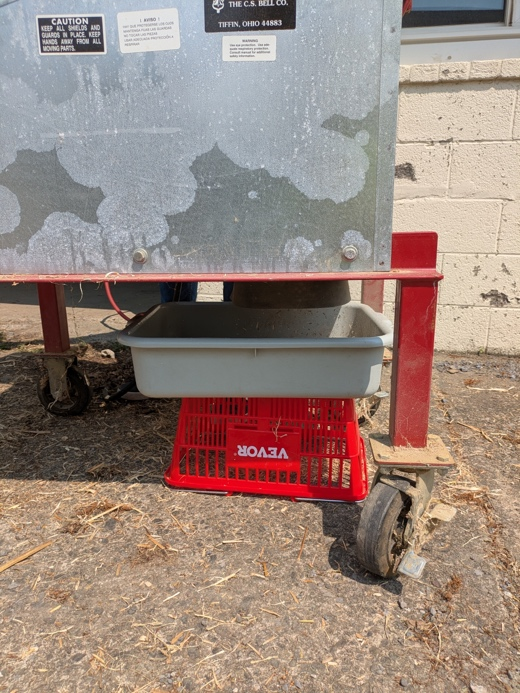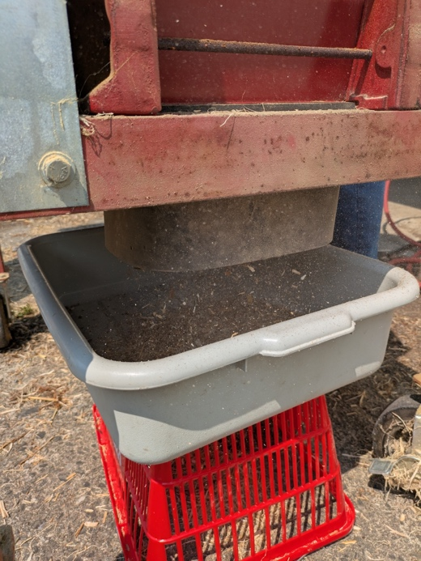

- Turn on hammer mill using the large green button

- Be sure to remove the envelope before shredding!

- Slowly feed the biomass into the hammer mill, using the push stick

  - NEVER reach your hand inside while the machine is operating!!!

  - It helps to break long stalk pieces into shorter sections to prevent
    jamming

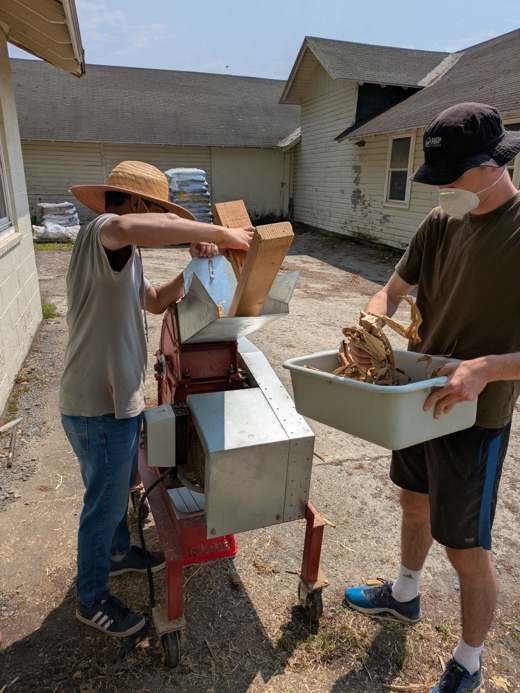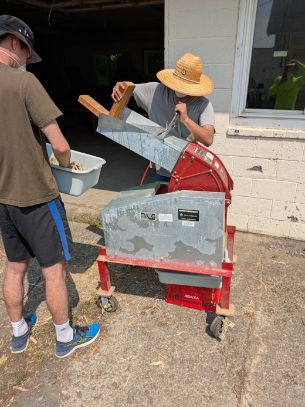

- Once the biomass is all shredded, take a small representative sample
  and place in the labeled envelope

  - Half-full is plenty

- Place sample with others

- Power down hammer mill and open

- Clean out any remaining biomass from the mill section and feeder chute
  using the air compressor

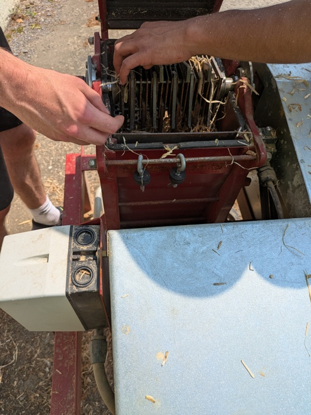

- Dump remaining biomass into compost container and clean out bus tub
